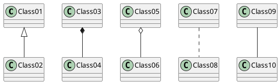

# Academic Text Correction System
This system aims to Academicians takes support about own academic publish from an official translator at own Institute.

The user uploads the document that must review. The translator makes corrections if it's necessary and the corrected document is uploaded to the system.

Users and translators follow all these process on the system.
***

